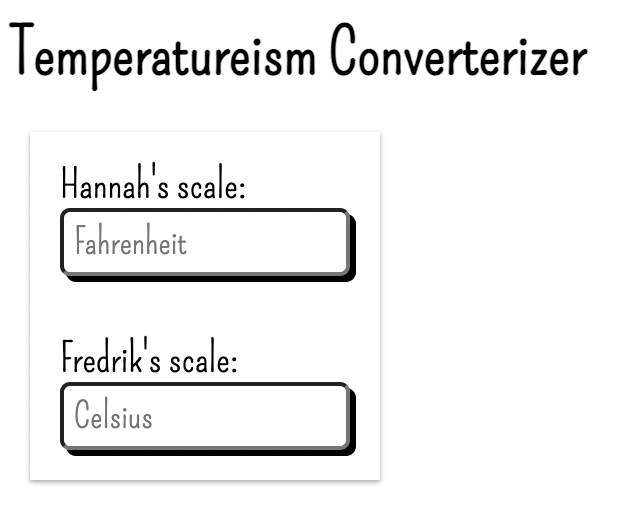

# Chrome extension for converting degrees between Celsius and Fahrenheit.

## Table of contents

- [Overview](#overview)
  - [The goal](#the-goal)
  - [Screenshot](#screenshot)
- [My process](#my-process)
  - [Built with](#built-with)
  - [What I learned](#what-i-learned)
  - [Continued development](#continued-development)
  - [Useful resources](#useful-resources)
- [Author](#author)
- [Acknowledgments](#acknowledgments)

## Overview

### The goal

Users should be able to:

- [x] Convert temperature from Fahrenheit to Celsius.
- [x] Convert temperature from Celsius to Fahrenheit.

### Screenshot

## My process

- I streamlined the layout considering it would serve as a Chrome extension.
- I maintained high contrast ratios (13.1:1, 7.74:1) throughout the website, passing all WCAG tests. Tested using [WebAIM](https://webaim.org/resources/contrastchecker/?fcolor=000000&bcolor=16DFBD).

### Built with

- Semantic HTML5 markup
- CSS
- Flexbox
- JavaScript

### What I learned

- How to get around an error message when trying to deploy the app as an extension on the Chrome browser.

- I got to practice switch cases in JavaScript.

### Continued development

To make the output not show any decimal if it's an integer.

### Useful resources

- [Nu Html Checker](https://validator.w3.org/nu/) - I ran my index.html through this conformance checker to catch any unintended mistakes.
- [CSS Validation Service](https://jigsaw.w3.org/css-validator/) - I ran my style.css through this conformance checker to catch any unintended mistakes.

## Author

- Website - [Coming soon!](#)
- GitHub - [@FredrikRidderfalk](https://github.com/FredrikRidderfalk)
- Twitter - [@yourusername](https://twitter.com/Ridderfalk)

## Acknowledgments

Thank you habibi, you're my inspiration!
